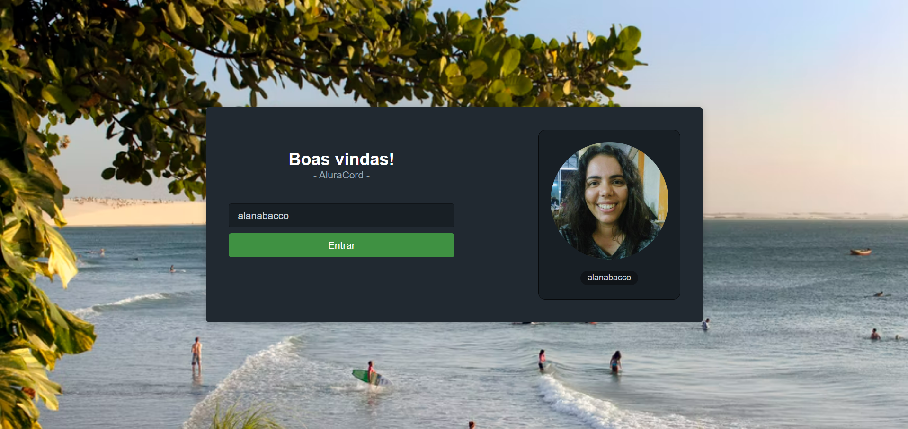

# AluraCord

## 💻 Sobre o projeto

O Aluracord é um chat inspirado no discord. O projeto foi desenvolvido durante a [Imersão React](https://www.alura.com.br/imersao-react) da [Alura](https://www.alura.com.br/) em janeiro de 2022, que contou com 5 aulas práticas para criar e colocar no ar uma aplicação React com NextJs.

🌐 Link do projeto: https://vercel.com/alanabacco/aluracord

### Funcionalidades

- Tela de Login;
- Tela de chat com mensagens em tempo real.

## 🖼️ Imagens

<figure align="center">
  
  <figcaption>Tela de Login</figcaption>
</figure>
<figure align="center">
  
  <figcaption>Tela do Chat</figcaption>
</figure>

## 🛠 Ferramentas e tecnologias utilizadas

- [React](https://pt-br.reactjs.org/)
- [NextJs](https://nextjs.org/)
- [Skynexui](https://github.com/skynexui/components)
- [Firebase](https://firebase.google.com/?hl=pt-br)
- [Visual Studio Code](https://code.visualstudio.com/)

# 🔥 Como executar o projeto localmente

Para executar o projeto de maneira local, execute os comandos:

```
> git clone https://github.com/alanabacco/aluracord
> npm install ou yarn
> npm run dev ou yarn dev
```

Abra o navegador e entre em 'https://localhost:3000'.

---

Desenvolvido por [Alana Bacco](https://github.com/alanabacco). <br />
[](https://www.linkedin.com/in/alana-bacco/)